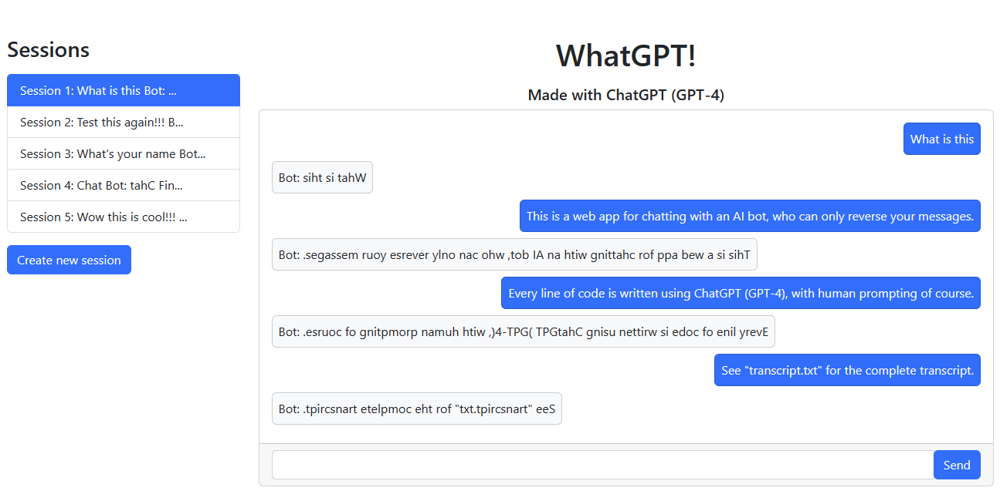

# WhatGPT!

WhatGPT! is a full-stack web application that allows users to chat with an AI chatbot using a modern and interactive chat interface. This web app is powered by ChatGPT (GPT-4) and was completely generated by ChatGPT (GPT-4) without any human-written code, except for the "transcript.txt" file, which contains the complete transcript of the ChatGPT session that generated the application. This includes both the source code and this README file.

## Features

- Interactive chat window for engaging with the AI chatbot
- Multiple chat sessions management, allowing users to create new sessions, switch between sessions, and view previous sessions
- Session names are automatically generated based on the content of the chat
- Chat history is stored server-side and repopulated in the frontend upon refreshing the page or switching sessions

## Tech Stack

- Frontend: React.js with Bootstrap for styling and Axios for API calls
- Backend: Flask with a simple in-memory storage for chat sessions
- AI Model: ChatGPT (GPT-4) is used to simulate the chatbot's responses

## Installation

1. Clone the repository:

git clone https://github.com/ekzhu/WhatGPT.git

cd WhatGPT

2. Set up a virtual environment and install the required packages for the backend:

python -m venv venv

source venv/bin/activate # On Windows, use venv\Scripts\activate

pip install -r requirements.txt

3. Install the required packages for the frontend:

cd frontend/chatbot

npm install

## Running the app

1. Start the Flask backend:

cd backend

export FLASK_APP=main.py # On Windows, use set FLASK_APP=main.py

flask run

2. Start the React frontend in a separate terminal:

cd frontend/chatbot

npm start

The web app should now be running at `http://localhost:3000`.
